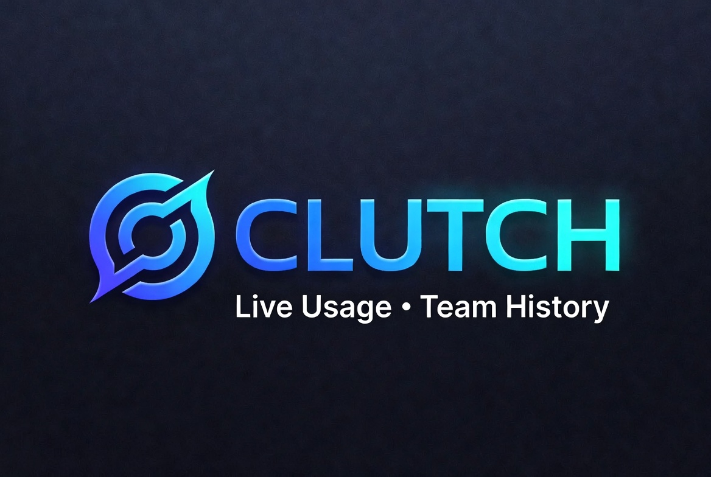

# CLUTCH — Claude's Live Usage & Team Conversation History



A lightweight, offline HTML tool for viewing Claude Teams conversation exports organized by user — with daily, weekly, and monthly usage summaries.

## Overview

CLUTCH allows Claude Teams administrators to merge user data with conversation exports, making it easy to browse conversations by team member and track usage trends over time. All processing happens locally in your browser — no data is sent anywhere.

## Features

- **Team overview dashboard** — Instantly see team-wide stats and activity after loading
- **At-a-glance stat cards** — Active users, totals, most active user, busiest day, avg per user, projects and design chats — each card jumps to its detailed section
- **View conversations by user** — Click any team member to see all their conversations
- **Usage summary** — See daily, weekly, and monthly conversation counts per user
- **Projects support** — Auto-detects the `projects/` export folder (or a legacy `projects.json`) and links each project to its creator
- **Design chats support** — Auto-detects the `design_chats/` export folder, links each chat to its user and project, with a dedicated overview, a per-user "Design only" filter, and drill-down
- **Cost & value analysis** — Enter your plan/seat cost and CLUTCH breaks down monthly/annual spend, license utilization, idle-seat waste, cost per active user / conversation / message, a reclaim recommendation, and a per-user value table flagging idle and low-usage seats
- **Spend report import** — Load the per-user spend report CSV from the Claude admin analytics dashboard (Settings → Analytics → Export spend report) to enrich the Cost & Value view with API-reported requests, tokens, and net/gross spend per user. Idle-seat detection then uses the dashboard's own activity data, and the reclaim card lists the exact idle users with a one-click **Copy emails** button
- **Members analytics import** — Load the members analytics CSV (`members-analytics-*.csv`) from the admin dashboard to see activity across *all* surfaces: chats, Claude Code sessions, cowork, file edits, PRs, and artifacts. Idle detection switches to the dashboard's own days-active figure — so heavy Claude Code users with zero chats aren't wrongly flagged as idle — plus seat tiers (Premium/Standard) with tier-aware idle-spend math, last-active dates, and owner-seat flagging in the reclaim list
- **Multi-archive, folder & .zip picker** — Current exports arrive as several separate `.zip` archives; select them all at once, drag them in together, or point CLUTCH at the folder holding them and it merges the lot. Older single-zip and loose-folder exports still work exactly as before, and you can always pick each file type individually
- **Export manifest checklist** — Drop in the `manifest-*.json` from a new-format export and CLUTCH shows which archives are loaded, which are still missing (with their download links), and whether any multi-part archive is incomplete
- **Load multiple conversation files** — Combine exports from different time periods
- **Search** — Find specific conversations or content within a user's history
- **Export to CSV** — Download a user's conversation summary as a spreadsheet
- **100% offline** — Works without an internet connection, all data stays on your machine

## Requirements

- A modern web browser (Chrome, Firefox, Edge, Safari)
- **Organisation admin access** — Only the original org admin can export data from Claude Teams. You must be the admin of the Claude Teams organisation to generate the export files used by this tool.
- The archives from your Claude Teams export (see [Getting Your Export Files](#getting-your-export-files)). Whether they arrive as several `.zip` files, one `.zip`, or a folder of loose JSON, CLUTCH needs:
  - **Users** — user UUIDs and names (`users.json`, shipped inside `light_metadata-000.zip`)
  - **Conversations** — conversation data with user UUID references (`conversations.json`)
  - **Projects** *(optional)* — project data associated with your organisation
  - **Design chats** *(optional)* — design chat data

## Installation

1. Download the `clutch.html` file
2. Open it in your web browser (double-click or drag into browser)

That's it — no server, no dependencies, no installation required.

## Getting Your Export Files

1. Log in to [claude.ai](https://claude.ai) as an **organisation admin**
2. Navigate to **Settings → Organisation → Export data**
3. You'll receive a `manifest-<org>-<timestamp>.json` file listing several separate archives, each with its own download link:

   | Archive | Contents | Used by CLUTCH |
   | ------- | -------- | -------------- |
   | `light_metadata-000.zip` | `users.json` | yes |
   | `conversations-000.zip` | `conversations.json` | yes |
   | `projects-000.zip` | `projects/*.json` | yes |
   | `design_chats-000.zip` | `design_chats/*.json` | yes |
   | `memories-000.zip` | `memories/*.json` | no — ignored |

   **Each download link works only once.** Download all of them into a single folder before loading. A large organisation may see an archive split into numbered parts (`conversations-000.zip`, `conversations-001.zip`, …) — download every part.
4. In CLUTCH, select all the `.zip` files at once, drag them onto the export zone together, or click **"Open folder"** and point it at the folder containing them. There's no need to unzip anything.

Older exports that produced a single zip, or a folder of loose JSON files, still load exactly as before.

## Usage

### Step 1: Load Your Files

The fastest route is to load the whole export in one action:

- **Open .zips** — select every archive from your export at once
- **Open folder** — point CLUTCH at the folder holding the archives; any loose JSON or analytics CSV sitting alongside them is picked up in the same pass
- **Drag & drop** — drop all the archives onto the export zone together

CLUTCH merges the archives, detects which file is which, and lists what it found. If the export's `manifest-*.json` is included, a checklist appears showing any archive still missing.

Or pick each file type individually:

- **Users JSON** — Drag & drop or click to upload your users file
- **Conversations JSON** — Drag & drop or click to upload one or more conversation files

The tool auto-detects the field mappings (UUID, username, etc.)

### Step 2: Click "Load & View"

Once both files are loaded, click the button to process the data.

### Step 3: Browse Conversations

- Click any user in the left sidebar to view their conversations
- Switch between **Conversations** and **Usage Summary** tabs to see activity trends
- Use the search box to filter conversations
- Click a conversation to expand and read the messages
- Use "Export CSV" to download the selected user's conversation list

### Adding More Conversations

Click "+ Add More Conversations" in the sidebar to load additional conversation files at any time. The new data merges automatically.

### Importing a Spend Report (optional)

1. In [claude.ai](https://claude.ai), go to **Settings → Analytics** (Owner/Primary Owner on Team; also Admins on Enterprise) and click **Export spend report** — pick a period of up to the last 90 days
2. In CLUTCH, load your export first, then open the **Cost & Value** tab and click **💰 Import spend report CSV** (the CSV is also auto-detected when you select a folder/zip containing it)
3. The Cost & Value tab switches to spend-based activity: per-user requests, tokens, and net spend columns; team totals for reported spend; and idle/low status derived from the report's request counts — matching the admin dashboard's "seats in use" figure

Rows are matched to users by account UUID, falling back to email. Spend rows that match no loaded user (e.g. deprovisioned accounts) are flagged under the table. Column headers are detected by keyword, so minor naming changes in the export won't break the import.

### Importing Members Analytics (optional)

1. In [claude.ai](https://claude.ai), go to **Settings → Analytics** and export the members table — the file is named `members-analytics-<org-id>-<from>-to-<to>.csv`
2. In CLUTCH, drop the CSV on the **📊 Members analytics CSV** zone on the load page (it's optional — you can proceed without it), use **📊 Import members analytics CSV** in the Cost & Value tab afterwards, or just include the file in the folder/zip you select and it's auto-detected
3. The Cost & Value tab then shows per-user Chats, Code sessions, Cowork, Last Active, and Seat Tier columns, team-wide Code/Cowork totals, and a **Premium seat ($/month)** price input when Premium tiers are present

Rows are matched to users by email (this export has no account UUID). Accounts whose seat tier is **Unassigned** hold no paid license — they're excluded from seat counts, idle detection, and the reclaim list, and show a grey **No seat** badge instead. Activity status follows a priority order: **members analytics (days active) → spend report (requests) → conversation counts**. Days-active counts activity on every surface — including Claude Code and cowork — so it matches the admin dashboard's seats-in-use figure and won't flag code-only users as idle. When both CSVs are loaded, status comes from members analytics while tokens and dollar figures still come from the spend report. Idle users with an Owner role are flagged so the role can be reassigned before the seat is reclaimed.

### Starting Over

Click "Start Over" to clear all data and load new files.

## Expected File Formats

### Users JSON

```json
[
  {
    "uuid": "abc123-...",
    "full_name": "John Smith"
  },
  {
    "uuid": "def456-...",
    "full_name": "Jane Doe"
  }
]
```

The tool looks for common field names: `uuid`, `id`, `user_id` for the identifier, and `full_name`, `name`, `username`, `email` for the display name.

### Conversations JSON

```json
[
  {
    "uuid": "conv-123...",
    "name": "Conversation Title",
    "created_at": "2025-01-15T10:30:00Z",
    "account": {
      "uuid": "abc123-..."
    },
    "chat_messages": [
      {
        "uuid": "msg-1",
        "text": "Hello!",
        "sender": "human",
        "created_at": "2025-01-15T10:30:00Z"
      },
      {
        "uuid": "msg-2",
        "text": "Hi! How can I help?",
        "sender": "assistant",
        "created_at": "2025-01-15T10:30:05Z"
      }
    ]
  }
]
```

The tool links conversations to users via the `account.uuid` field (or similar).

## Privacy & Security

- **All processing is local** — Your data never leaves your computer
- **No external requests** — The tool works completely offline
- **No data storage** — Nothing is saved; refresh the page to clear everything

### Why CLUTCH doesn't download the archives for you

Given the manifest contains a download link for every archive, it's a fair question. CLUTCH deliberately doesn't, and can't:

- **The browser blocks it.** The export endpoint returns no `Access-Control-Allow-Origin` header and sets `Cross-Origin-Resource-Policy: same-origin`. CLUTCH runs from a `file://` URL, so its origin is `null` and the browser refuses to hand the response to the page. No amount of client-side code changes this.
- **Cloudflare blocks non-browser clients.** Requests outside an authenticated browser session are met with a bot challenge.
- **Each link is single-use.** Even a working fetch would succeed only on the very first attempt after an export.
- **It would end the offline guarantee.** Reaching out to the network is precisely what this tool is built not to do.

So the manifest is treated as metadata only — a checklist of what your export contained, with the links rendered for you to click in your own browser session.

## Troubleshooting

### "Could not auto-detect field mappings"

Your file structure may differ from expected. Check that your users file has identifiable UUID and name fields, and that conversations have a user reference field.

### Users showing 0 conversations

The UUID field in your conversations may not match the UUID field in your users file. Verify that the user UUIDs correspond between the two files.

### Large files loading slowly

The tool handles large files but limits the display to 100 conversations at a time for performance. Use the search feature to find specific conversations. Archives are read one at a time rather than in parallel — `conversations.json` runs to hundreds of megabytes uncompressed, so this keeps memory in check at the cost of a slightly longer load.

### Something's missing after loading the archives

Include the export's `manifest-*.json` in your selection. The checklist that appears will name exactly which archive is absent. Bear in mind each download link works only once — if one was already used, re-export from **Settings → Organisation → Export data** to get a fresh set of links.

### A download link gives an error

The links are single-use and expire. Re-export to generate a new manifest.

## License

MIT License — Free to use and modify.
